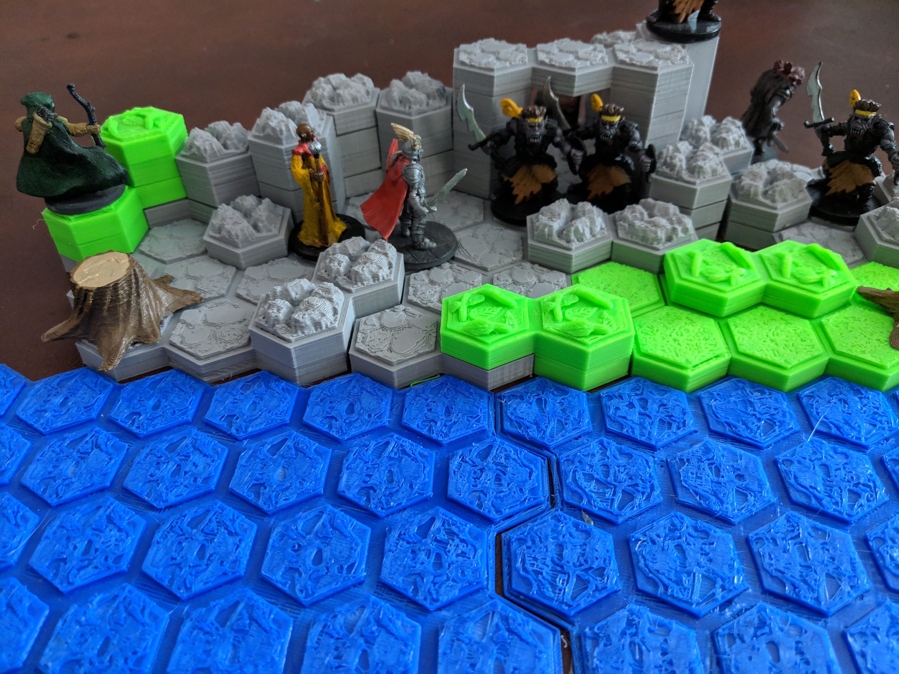

# OpenSCADHexTiles

This is a set of OpenSCAD programs for creating hex-tiled terrain. By default (it can be easily changed), the hexagons are circumscribed around a 1" (25.4mm) circle, to fit standard-sized minis and hex battle mats, although after playing with this a bit, I'm thinking 1.25" hexes might be easier if you aren't using them on battlements, since many of todays over-sized "heroic" minis have arms and weapons that stray outside the confines of the base.

If you don't want to deal with OpenSCAD, you can get a generic set of tiles from [Thingiverse](https://www.thingiverse.com/thing:3565401).

A brief summary of the files:

* BasicTiles.scad - A program for rendering simple tiles easily from the command line
* HexTiles.scad - A library for rendering actual tiles from the tile definition
* HexUtils.scad - A set of functions for working with tiled hexagon geometry, based on a [great blog post](https://www.redblobgames.com/grids/hexagons/) by Red Bolb Games
* MadMansGorge.scad - A set of custom tiles for a scenario I'm working on, and a good example of how to create custom tiles.
* make_tiles.sh - a bash script (sorry, Windows users) for generating a whole ton of standard tiles
* TextureMaker.scad - A program for image textures into stl, which can then be simplified to speed up tile rendering
* <file>Test.scad - Tests for the corresponding file. Of note, HexTilesTest.scad can generate a tolerance test you can use to adjust the tolerance value in HexTiles.scad to get the best fit for your 3D printer. 
